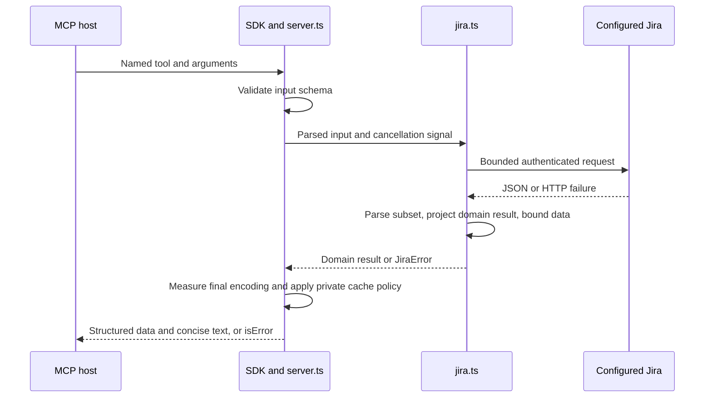

# Jira MCP server architecture

Designed on 2 October 2026 for the functionality in the [implementation plan](mcp-implementation-plan.md). This document and its [TypeScript contract sketches](architecture/README.md) remain the design baseline. The runtime registers 22 read-only tools: the nine primary reads, issue and comment recovery, Agile reads, metadata preparation, and supporting reads. Mutations are not implemented pending a designated test issue. The attachment-byte reader is implemented but remains unadvertised pending live content-route compatibility evidence.

Use a concrete Jira client behind the official MCP SDK's named tools. The client owns Jira paths, authentication, response parsing, pagination, and operation policy. The SDK adapter owns tool registration and protocol results. This keeps a normal call trace within `server.ts`, `jira.ts`, and the shared schemas.

## Caller workflow

The first workflow is search, issue detail, discussion, and scoped access. The MCP host starts one local process with `JIRA_URL` and `JIRA_KEY` in its environment. The model calls `jira_search_issues`, chooses a returned issue key, calls `jira_get_issue`, and follows comment pages with `jira_list_comments`. It can discover fields by ID and inspect the user's access without constructing Jira URLs.

Results contain domain data, provenance, and explicit omissions. A missing permission is `unknown`. A field Jira returned as null remains null; a field omitted to fit the result budget is absent and has an omission record. An empty remote-link list is a successful read. A changelog carries its completeness rather than claiming every history entry is present.

The [usage sketch](architecture/usage.ts) records issue research, recovery of a large description, and an optional update. The [schemas](architecture/schemas.ts) distinguish caller arguments from validated handler inputs with defaults applied. The [contracts](architecture/contracts.ts) define results and client signatures.

## Investigation outcomes

The repository retains the [capability report](jira-capability-report.md) and [sanitized evidence](jira-discovery-evidence.json), with private response snapshots in ignored `work/discovery/`. The temporary Python scripts have been removed. No investigation code becomes part of the runtime; all server functionality is implemented in TypeScript.

The [capability report](jira-capability-report.md) records self-managed Jira 10.3.25 with platform REST v2 and Agile REST v1. Descriptions were strings or null. Field names can repeat, project and issue permissions differ, create metadata was sampled rather than exhausted, and the embedded changelog's completeness remains unverified. Writes and attachment bytes were not tested. These are architecture constraints, not runtime assumptions to fill with defaults.

The runtime derives its contracts from endpoint observations rather than copying SIMPL-specific investigation selections. In particular, first-page metadata observations are insufficient for validating a create operation. The sanitized evidence omits some response details, including sprint end markers and changelog completeness, so the report and endpoint fixtures must accompany implementation verification.

## Foundation

Use TypeScript 7, Node.js 24 LTS, ESM, npm with an exact lockfile, and Zod 4. TypeScript 7 is distributed as `typescript` and supplies `tsc`. Its initial release does not expose the old compiler API, so build with the CLI and avoid compiler-dependent tooling until compatibility is verified. Set `module` and `moduleResolution` to `NodeNext`, set `types` to `["node"]`, and enable strict checking, `noUncheckedIndexedAccess`, and `exactOptionalPropertyTypes`. [Microsoft release documentation](https://devblogs.microsoft.com/typescript/announcing-typescript-7-0/).

Use SDK v2's `@modelcontextprotocol/server` at runtime and the matching `@modelcontextprotocol/client` for integration tests. The official repository identifies v2 as the stable line and documents the split packages and Standard Schema support. [SDK repository](https://github.com/modelcontextprotocol/typescript-sdk). Node 24 is the runtime target from the plan and the [Node release schedule](https://nodejs.org/en/about/previous-releases).

Construct an `McpServer` through the `serveStdio` factory. Keep its default support for legacy clients, and test both modern discovery and the intended host's legacy protocol. The SDK owns wire dispatch, protocol selection, and connection teardown. [Stdio serving](https://ts.sdk.modelcontextprotocol.io/v2/serving/stdio.html), [legacy clients](https://ts.sdk.modelcontextprotocol.io/v2/serving/legacy-clients.html).

The runtime pins `@modelcontextprotocol/server` 2.2.0, `@modelcontextprotocol/client` 2.2.0, TypeScript 7.0.2, Zod 4.6.5, and `@types/node` 24.19.1. The strict build passes on the available Node 26.3.0 host. The Node 24 target and the eventual MCP host have not been exercised.

## Module ownership

Keep the initial runtime at the four modules already proposed in the plan:

```text
src/
  index.ts       Environment parsing, process lifecycle, serveStdio factory
  schemas.ts     Tool schemas, domain output schemas, inferred semantic types
  jira.ts        Concrete JiraClient, private wire schemas, requests and operation policy
  server.ts      Named registrations, annotations, MCP result and error encoding
test/
  jira.test.ts   Actual client calls against a fake HTTP service
  server.test.ts Official MCP client against the child process over stdio
```

`index.ts` validates configuration once. The runtime deliberately tightens the design's HTTP-or-HTTPS allowance to HTTPS only because it sends a bearer token. It rejects URLs with userinfo, query, or fragment, preserves an installation path, and rejects missing credentials or an invalid write flag. In the current release, exact `true` is rejected while writes are unimplemented; after the write gate passes, exact `true` will enable them and unset or `false` will disable them. `server.ts` receives the client and a boolean, rather than reading the environment itself.

`schemas.ts` owns public input and output schemas. Handlers use inferred output types, including branded keys and IDs. The handwritten result types in the architecture sketch are design targets; implementation replaces them with schema-inferred types rather than maintaining parallel declarations. Jira wire schemas remain private to `jira.ts`, beside the operations that understand them.

`jira.ts` completes operations behind named methods. `getAccess` aggregates identity, version, and correctly scoped permissions. `getProject` composes project collections. A write method checks its own permissions and metadata before dispatch. Callers do not assemble a write from separate check, prepare, and execute methods.

`server.ts` adapts these methods to MCP. Its delegation adds protocol validation, descriptions, annotations, error conversion, and final result measurement. It adds no second service layer. Split either large module by Jira knowledge, such as Agile or mutations, only when concrete implementation size calls for it. Move an operation's private schemas with its methods.



## Functionality and delivery gates

The nine primary read tools remain `jira_get_access`, `jira_list_projects`, `jira_get_project`, `jira_list_fields`, `jira_search_issues`, `jira_get_issue`, `jira_list_comments`, `jira_list_remote_links`, and `jira_list_transitions`. Their endpoint mappings remain in the [implementation plan](mcp-implementation-plan.md#initial-tools). Contracts add offsets and limits to array-backed collections so an omitted project, field, link, or transition remains reachable. Project detail can select one collection when continuing it. These tools and the first read-only extensions are implemented in `src/` with fake-Jira and official-client stdio coverage; live Jira acceptance remains outstanding.

The `jira_read_issue_field` and `jira_read_comment` recovery reads return bounded windows tied to the source revision. Comment recovery scans at most 20 pages of 100 entries on the verified comment-list endpoint. If a page contains the exact comment ID, recovery can return it immediately. To report that an ID is absent, the scan requires a stable total and the reported end; missing completeness evidence, a changed total, or reaching the 2,000-entry cap returns `unavailable`. It never substitutes a different comment.

The verified Agile, write-preparation, and supporting read groups are implemented within the same boundary:

- Agile reads cover boards, configuration, board issues, and sprints. Preserve `isLast`; unsupported sprint access on a Kanban board becomes a clear failure.
- Write preparation covers paged create metadata, edit metadata, and bounded assignable-user lookup. These reads remain available while mutations are disabled.
- Basic writes cover creation, field replacement, comments, assignment, transitions, and issue links. The runtime does not implement these until a designated test issue is selected; each operation will need test-issue execution and read-back evidence before its release gate passes.
- Supporting reads cover worklogs, favorite filters, dashboards, and attachment metadata. Discovery returned empty worklogs; synthetic tests cover nonempty entries. Live worklog behavior remains unverified.
- The attachment-byte reader resolves content URLs from Jira metadata and enforces same-origin HTTPS under the configured installation path, a small MIME allowlist, content-size limits, manual redirects, UTF-8 validity, and image signatures. It rejects encoded percent signs, dots, and path separators before sending the bearer token, which prevents a later proxy decode from changing the checked path. Synthetic tests cover these checks; the tool remains unadvertised until the live content route and access behavior are verified. No tool accepts an attachment URL. Uploads and worklog changes remain outside the current contract package because their payloads are unverified.

Do not advertise a group merely because its signature exists in the sketch. Shared hosting, multiple users, OAuth, administration, deletion, bulk changes, sprint management, Confluence, and plugin APIs remain outside the plan.

## Data contracts

`PermissionScope` is a tagged global, project, or issue value. `Permission` has allowed, denied, and unknown states. A successful permission response missing a flag produces unknown for that flag. A failed permissions request produces an error rather than an empty permission set. No global flag grants permission on a particular issue.

`Page<T>` carries items, `startAt`, the returned count, and a continuation union. `hasMore=true` requires `nextStartAt`; `false` has no next offset; unknown completeness is explicit. Its upstream evidence distinguishes a total, an Agile end marker, a locally sliced catalog, and unknown completeness. Do not invent an Agile total. If result packing returns only part of an upstream final page, the public page can have more items to deliver while preserving upstream `isLast=true`.

Array catalogs are filtered, put in deterministic order, and sliced locally on each request. Jira search and comment pages preserve upstream order. Offset pages are live reads, not snapshots, so concurrent Jira changes can cause repeats or omissions across pages. Text windows additionally verify the source's `updated` value; that protects reconstruction of a single value, not the whole search result.

Custom-field values stay `unknown`, keyed by field ID. Missing `required`, `operations`, or `allowedValues` in Jira field metadata is reported as the explicit string `unknown`; malformed present values fail response validation. Parsing establishes JSON validity, while field metadata supplies meaning when available. Do not interpret a GreenHopper string or plugin-defined value as a universal Jira type. Default issue projections exclude comments and full history. Caller-selected fields are bounded explicit IDs, without unrestricted wildcard expansion. Identity projections omit email and unrelated user-profile data.

## Limits and recovery

The following built-in limits make the plan concrete. Fake-service tests cover these boundaries; the values are conservative defaults, not measured Jira limits.

- A logical HTTP request has a 20-second deadline covering queue wait, retries, backoff, and body consumption. A composed tool operation has a 60-second deadline across all its requests.
- At most four requests are active per process. Waiting requests observe cancellation. Release permits after response consumption or failure, and do not hold them while sleeping between retries.
- Read operations can retry 429 and transient 502, 503, or 504 at most twice. Retry waits total at most five seconds and stay inside the deadlines. If `Retry-After` cannot be honored within that allowance, return throttling without retrying early. Other failures do not retry.
- Stream-count decoded HTTP JSON bytes before parsing, with an 8 MiB cap. Set `redirect: "manual"`. Reject redirects, HTML login pages, invalid JSON, and unexpected response shapes explicitly.
- Bound serialized tool inputs at 128 KiB before Jira I/O. Bound domain read results at 220 KiB, leaving room for concise text and MCP metadata inside a final 256 KiB result. Measure the complete SDK encoding for both supported protocol eras during integration tests.
- List arguments default to 20 and allow at most 100. Selected fields allow at most 50. Text windows default to 4,000 Unicode code points and allow at most 8,000.

The Jira client owns projection and recovery because it knows the operation's semantics. It removes only whole list items from a page. The next offset advances by the count actually delivered, so fetched but omitted items remain reachable. If even one item cannot fit, preserve its identifier and return `result_too_large`; never advance past it with an empty success.

An oversized issue field or comment body is absent from the normal payload and has an omission record naming its recovery tool, resource, and revision. Comment recovery returns an exact match found on a page without requiring unrelated paging evidence. If the ID is missing from that page, it scans bounded sequential pages and requires a stable total before it can report absence; otherwise it fails as unavailable. Recovery windows return plain text for strings and deterministic JSON text for other values, including null. Offsets count Unicode code points, not UTF-16 units or bytes. Every window after offset zero requires `expectedUpdated`; a mismatch produces `source_changed` and the caller restarts. Null and an omitted body have distinct representations.

A request that still exceeds 8 MiB after selecting a single field fails explicitly. Jira provides no verified byte-range field endpoint. Oversized transition metadata or changelog fragments also need explicit omissions or a failure; text helpers do not imply support for dedicated changelog pagination. The server adapter checks the final encoded byte count but does not repair an oversized result by slicing JSON.

Embedded changelog has a separate completeness contract and no advertised next offset. A partial history states that its continuation endpoint is unverified. General list pages can offer continuations only when their tool accepts the corresponding offset.

## Errors, protocol, and lifecycle

The client translates HTTP status, endpoint context, and parse failures into a sanitized `JiraFailure`. Distinguish invalid JQL or fields, rejected credentials, denied access, missing or hidden resources, throttling, timeout, unavailable upstream, invalid response, size limits, changed text, stale edits, incomplete metadata, and unknown mutation outcomes. A 404 does not prove nonexistence. Do not include arbitrary upstream bodies, token values, or authorization headers in an error.

Operational failures become `isError=true` tool results containing safe error codes and guidance. Unexpected internal failures get a generic message. The SDK owns malformed protocol requests. Its documented schema validation rejects invalid tool arguments before the handler runs, and output schemas validate structured output. [SDK tools](https://ts.sdk.modelcontextprotocol.io/v2/servers/tools.html).

Pass `ctx.mcpReq.signal` into every operation, queue wait, retry wait, and fetch. The SDK aborts it on cancellation and disconnect and discards a cancelled call's response. Release timers and permits during unwinding. [SDK cancellation](https://ts.sdk.modelcontextprotocol.io/v2/servers/logging-progress-cancellation.html).

Stdout carries MCP frames only. Safe diagnostics go to stderr without Jira text, raw error bodies, or credentials. Stdin EOF lets the SDK close the connection; signal handlers close the returned stdio handle. No database, persistent cache, background worker, or LLM API belongs in this process.

Let the SDK emit modern discovery and response metadata, including required result types. Tool catalog content depends on the write setting and installed groups. Jira results depend on a principal. Ensure any SDK cache metadata for these responses is private, and verify emitted `ttlMs` and `cacheScope` rather than assuming defaults. The server adds no persistent Jira cache. [MCP caching contract](https://modelcontextprotocol.io/specification/2026-07-28/server/utilities/caching).

## Future mutation contract

The current runtime has no write tools and rejects `JIRA_ENABLE_WRITES=true`. When the write group is implemented and passes its acceptance gate, register its tools only in that mode. The client must also enforce the flag before any mutation, so an internal call cannot bypass disabled writes. Tool annotations describe behavior; they do not establish human approval. The MCP host owns its approval policy.

Each write method obtains fresh permissions at the target project or issue scope, reads the relevant metadata, validates fields and supported values, and then dispatches once. Creation requires every create-field metadata page for the chosen type. Metadata paging must make progress and finish within the operation deadline; otherwise return `metadata_incomplete` without sending the write. Never validate a payload against metadata trimmed for a public result.

For field updates, the initial contract supports replacement values in `fields`, including explicit null when metadata allows clearing a field. Reserve `project` and `issuetype` in creation for the explicit arguments. Do not expose Jira's arbitrary update verbs or assume generic validation can establish every plugin validator. Preserve upstream rejection with a safe explanation when the validated payload still fails.

Assignments use the self-managed username returned by lookup, including explicit null to unassign when allowed. Transitions use a current transition ID and its field metadata. Issue links validate the link type and the relevant scoped permissions for both sides. Preflight reads improve feedback but do not create an atomic permission or version guarantee.

An optional `expectedUpdated` check detects stale reads before an edit, assignment, or transition. It cannot prevent a change between the check and dispatch. There is no claim of atomic compare-and-swap or exactly-once execution.

Never automatically retry mutations. Before dispatch, errors have a known no-write outcome. After dispatch, lost responses, timeouts, cancellation, and ambiguous upstream failures produce `write_outcome_unknown` with read-only reconciliation guidance. A cancelled or disconnected host might never receive this error; it must reconcile before repeating a write.

An acknowledged receipt means Jira accepted the request. Its verification state separately says whether a read proved the effect. Failure of that read does not turn an acknowledged write into a failed mutation. Return real issue and comment IDs when supplied or verified. A link endpoint may acknowledge without an ID; return its issue pair and type, and include an ID only when uniquely established. Creation reconciliation through search is best effort because no durable deduplication token exists.

## Verification and implementation order

The toolchain is locked and the first stdio release compiles. Its official-client tests cover modern discovery, the legacy compatibility path, private cache metadata, stdout isolation, and cancellation. The packed artifact installs in a clean directory and the installed server returns tools and comment recovery through the official client. Node 24 and the intended MCP host still need a run.

The 22 registered read tools, including comment recovery, are implemented. Fake HTTP tests exercise installation paths, authentication headers, redirects, malformed responses, response limits, retry behavior, pagination, changed revisions, and cancellation. Official-client tests exercise the catalog through stdio in both protocol eras. The attachment-byte reader has direct synthetic safety tests but remains unregistered until its live content route and access behavior are verified. Begin writes only after a designated test issue is selected.

The advertised read groups are implemented. Live reads remain opt-in. Attachment metadata uses the verified `/search` route with an exact issue-key JQL filter and only the attachment field selected. The attachment-byte reader remains unadvertised pending live route compatibility. Implement writes only after a designated test issue is selected, then read back every successful effect. The clean package install is verified; the actual host's issue-research workflow remains open. The [rationale](architecture/rationale.md) records the compared designs and the synthesis decision.
