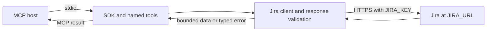

# Jira MCP implementation plan

Implementation plan based on the [live capability report](jira-capability-report.md), updated 2 October 2026.

## Implementation status

The registered read-only catalog contains 22 tools in `src/`: the nine primary research tools, two recovery reads, four Agile reads, three metadata-preparation reads, and four supporting reads. The strict build, fake-Jira client tests, modern and legacy official-client stdio tests, and repository architecture check pass. Jira live acceptance has not been run. The attachment-byte reader is implemented and synthetically tested but not registered; its live content-route compatibility gate remains open. Basic writes require a designated test issue before implementation and acceptance, and the current server rejects `JIRA_ENABLE_WRITES=true`.

Build a local stdio MCP server for individual use, using TypeScript 7, Node.js 24 LTS, and the official TypeScript SDK v2. Start with verified Jira reads. Add explicitly enabled write tools after testing them on a designated Jira test issue. Read the Jira base URL from `JIRA_URL` and the user's PAT from `JIRA_KEY`. The [implementation tasks](implementation-tasks.md) track the functionality to deliver.

The [architecture](mcp-architecture.md) refines this plan into module ownership and [TypeScript contracts](architecture/README.md). It adds paged array catalogs, recoverable large-value reads, concrete request budgets, and distinct acknowledged and uncertain write outcomes. The registered read groups now have a runtime; writes and attachment-byte advertisement still require their separate acceptance evidence.

## Scope and design decision

The first release lets an MCP client search issues, inspect an issue and its discussion, discover fields and projects, and check the current principal's permissions. It needs no database, web framework, background synchronization, or Jira administration access.

A generic `jira_request(method, path, body)` tool would expose the REST API quickly, but it would make every model call responsible for paths, pagination, field formats, and operation safety. Use named tools with validated inputs and bounded results instead. A generated client for all Jira endpoints would add substantial API coverage that the token and investigation have not verified. A small `fetch` client covering the selected endpoints is the preferred starting point.

The server uses one person's token per local process. Shared hosting, multiple users, and OAuth are outside scope. Confluence and plugin-specific APIs are also outside scope. The configurable URL targets compatible self-managed Jira installations; Jira Cloud support is not implied. The discovery scripts and historical report remain specific to SIMPL.

`JIRA_URL` and `JIRA_KEY` are the only required environment variables. Preserve any installation path in the configured URL. `JIRA_ENABLE_WRITES` is optional and defaults to `false`. Other settings use built-in defaults until a concrete need justifies additional configuration.

## Stack and release verification

| Component | Proposed choice | Basis |
| --- | --- | --- |
| Language/compiler | TypeScript 7.0.2 | Microsoft released TypeScript 7 on 8 July 2026. [Release announcement](https://devblogs.microsoft.com/typescript/announcing-typescript-7-0/). |
| Runtime | Node.js 24 LTS, ESM | Node 24 is LTS on the investigation date. [Node release schedule](https://nodejs.org/en/about/previous-releases). |
| MCP server | `@modelcontextprotocol/server` 2.2.0 | SDK v2 is the stable line for MCP 2026-07-28. [SDK repository](https://github.com/modelcontextprotocol/typescript-sdk). |
| MCP test client | `@modelcontextprotocol/client` 2.2.0 | The SDK publishes separate server and client packages. [Package documentation](https://ts.sdk.modelcontextprotocol.io/v2/get-started/packages.html). |
| Validation | Zod 4.6.5 | The SDK accepts Standard Schema; Zod keeps input schemas and inferred types together. [SDK introduction](https://ts.sdk.modelcontextprotocol.io/v2/). |
| HTTP calls | Node's built-in `fetch` and `AbortController` | Only the selected Jira operations need a client. |
| Build/test | `tsc` to JavaScript; `node --test` on built test files | Avoid adding a runtime transpiler or a compiler-API dependency. |
| Package manager | npm and a checked-in lockfile | Pin the tested dependency versions. |

TypeScript 7.0 does not provide the old programmatic compiler API. That matters for tools which embed the compiler, not for this server's HTTP and MCP handlers. Add lint tooling only after checking its TypeScript 7 support. The initial build does not need a TypeScript 6 compatibility package.

The exact package versions are pinned in `package.json` and `package-lock.json`. Reviewed registry access enabled installation and a strict compilation. Verification ran on Node 26.3.0 because Node 24 was not available on the host; the declared engine remains `>=24`.

## MCP protocol contract

Target specification `2026-07-28`. It replaces the modern protocol's initialization handshake with per-request metadata and requires `server/discover`. Let the SDK implement those wire details. Do not write a custom JSON-RPC dispatcher. [MCP discovery](https://modelcontextprotocol.io/specification/2026-07-28/server/discover), [release changes](https://modelcontextprotocol.io/specification/2026-07-28/changelog).

Use `McpServer` and the v2 `serveStdio` factory entry point. Keep its documented legacy-client support so 2025-era clients can use the same tools through the SDK's compatibility path. Test that path separately from modern discovery; compatibility is not established merely by selecting the SDK. [SDK server tutorial](https://ts.sdk.modelcontextprotocol.io/v2/get-started/first-server.html), [legacy-client support](https://ts.sdk.modelcontextprotocol.io/v2/serving/legacy-clients.html).

The server advertises only implemented capabilities. Initially this is `tools`; resources, prompts, subscriptions, sampling, and tasks are unnecessary. Tool names and ordering remain deterministic. Each tool has a description, input schema, output schema, and appropriate annotations. Successful handlers return bounded structured data plus concise text useful to clients. Jira operational errors become tool results with `isError=true`; malformed protocol requests remain SDK errors. Annotations describe behavior and do not authorize it. [MCP tools](https://modelcontextprotocol.io/specification/2026-07-28/server/tools).

Modern responses include the required `resultType`; cacheable catalog responses include `ttlMs` and `cacheScope`. Verify the SDK's emitted response, using private caching for anything dependent on identity or permissions. Do not accidentally inherit public caching for Jira content. [MCP caching](https://modelcontextprotocol.io/specification/2026-07-28/server/utilities/caching).

Write diagnostics to stderr. Stdout contains MCP messages only. Forward cancellation to Jira requests and exit cleanly when stdin closes. [MCP stdio transport](https://modelcontextprotocol.io/specification/2026-07-28/basic/transports/stdio).

## Initial tools

These tools form the first useful release. All are read-only and use the endpoints verified in discovery. Parameters below are the public contract sketch, not TypeScript declarations. Unless stated otherwise, a list request defaults to 20 items and accepts at most 100.

| Tool | Inputs | Result and Jira mapping |
| --- | --- | --- |
| `jira_get_access` | Optional `projectKey` or `issueKey`, mutually exclusive | Current user summary, server version, and permissions with explicit scope. `/myself`, `/serverInfo`, `/mypermissions`. Omit email by default. |
| `jira_list_projects` | Optional project key filter | Visible project IDs, keys, names, and types from `/project`. |
| `jira_get_project` | `projectKey` | Project details, issue types, components, and versions from the project endpoints. Bound large collections and report truncation. |
| `jira_list_fields` | Optional text filter and `customOnly` | IDs, names, and schemas from `/field`; pagination over the catalog in server memory. Duplicate names remain distinct. |
| `jira_search_issues` | `jql`, optional `fields`, `startAt`, `maxResults` | Selected issue summaries and paging data from `/search`. Default fields exclude comments and full histories. |
| `jira_get_issue` | `issueKey`, optional `fields`, `includeChangelog=false` | Issue fields, link metadata, browse URL, and `updated`. Custom fields preserve their IDs and values. Changelog includes available completeness information. |
| `jira_list_comments` | `issueKey`, `startAt`, `maxResults` | Comment IDs, text, author summary, timestamps, and page metadata from `/comment`. |
| `jira_list_remote_links` | `issueKey` | Link titles and URLs from `/remotelink`. Empty list is a valid success. Do not fetch remote URLs automatically. |
| `jira_list_transitions` | `issueKey` | Transition IDs, names, target statuses, required fields, and allowed values from `/transitions?expand=transitions.fields`. |

Example client workflow: search `project = SIMPL ORDER BY updated DESC`, select a returned key, call `jira_get_issue`, then fetch the next comment page if needed. The server reports Jira data; the model performs the summary. No LLM API belongs inside this MCP server.

The architecture adds `startAt` and `maxResults` to array-backed lists and optional collection selection to project detail. The `jira_read_issue_field` and `jira_read_comment` helpers return bounded text windows; later windows require the first source revision. Comment recovery scans at most 2,000 entries on the verified comment-list route and reports unavailable when it cannot prove the scan complete. Oversized comments identify their recovery tool. See the [recovery contract](mcp-architecture.md#limits-and-recovery).

Use `readOnlyHint=true`, `destructiveHint=false`, `idempotentHint=true`, and `openWorldHint=true` for these read tools. Reads can return changed data on a later call even though they do not mutate Jira.

## Later tool groups

The verified read groups below are implemented and covered by synthetic Jira responses. Live Jira acceptance remains outstanding.

| Group | Proposed tools | Reason and prerequisites |
| --- | --- | --- |
| Agile reads | Implemented: `jira_list_boards`, `jira_get_board`, `jira_list_board_issues`, `jira_list_sprints` | Board and sprint APIs succeeded. Preserve Agile `isLast` semantics and do not assume every board supports sprints. |
| Write preparation | Implemented: `jira_get_create_metadata`, `jira_get_edit_metadata`, `jira_find_assignable_users` | Needed to supply mandatory custom fields and avoid invalid updates. Read all metadata pages needed for the chosen issue type. |
| Basic writes | Gated: `jira_create_issue`, `jira_update_issue`, `jira_add_comment`, `jira_assign_issue`, `jira_transition_issue`, `jira_link_issues` | The repository requires a designated test issue or project before write implementation and acceptance. Read back every successful effect. |
| Additional reads | Implemented: `jira_list_worklogs`, `jira_list_favourite_filters`, `jira_list_dashboards` | Endpoints responded successfully but are not required for the first issue-research workflow. |
| Attachment reads | Metadata implemented: `jira_list_attachments`; byte reader implemented but unadvertised: `jira_read_attachment` | Synthetic checks cover same-origin URLs under the configured installation path, manual redirects, an allowlisted MIME set, signatures, UTF-8, and the 128 KiB limit. Verify the live content route and access behavior before advertising it. |
| Additional writes | Attachment upload and worklog create/update | Defer until there is a use case and a tested payload contract. The instance advertises a 10 MiB upload limit. |

Do not initially expose issue deletion, bulk change, global administration, project configuration, sprint management, webhooks, Service Management, or plugin-specific operations. Some deletion permissions exist, but those operations are unnecessary for the intended issue workflow. Sprint management and administration are denied, and the remaining product APIs are unverified.

## Jira client and data contracts

Keep the initial implementation small:

```text
src/
  index.ts           reads configuration and starts serveStdio
  server.ts          registers the tool catalog and maps results/errors
  jira.ts            performs Jira requests, pagination, and response parsing
  schemas.ts         defines tool inputs and the Jira response subsets in use
test/
  jira.test.ts       exercises actual client calls against a fake HTTP service
  server.test.ts     calls the server through the official MCP client
```

Split `server.ts` by tool group only when its size justifies it. Keep HTTP details in `jira.ts` and validate external inputs and responses at those boundaries. There is no generic repository interface or dependency-injection framework.

The intended call flow is:



Use schema-inferred types for issue keys, tool arguments, responses, and errors. Keep unknown custom-field values as `unknown` until their schema is inspected. Model permission scope as one of global, project, or issue. A missing permission is unknown, not implicitly allowed. Use distinct Jira numeric IDs and issue keys in signatures rather than a single ambiguous `id` argument.

Return lists with `items`, `startAt`, returned count, `hasMore`, and `nextStartAt` when available. Include Jira's `total` only if the endpoint provides it. Do not synthesize totals for Agile responses that only supply `isLast`. Keep MCP catalog cursors separate from Jira tool-result pagination.

## Request limits and failure behavior

- Construct paths from validated keys and IDs under the configured `JIRA_URL`, preserving any installation path. Validate the URL at startup; tool inputs cannot supply arbitrary URLs, methods, or headers.
- Read `JIRA_KEY` from the environment and attach it only to Jira requests. Never place it in tool arguments, resources, error text, logs, or a checked-in client configuration.
- Disable automatic redirects. Attachment retrieval resolves an ID through exact-key Jira metadata, validates a same-origin HTTPS content URL, and bounds supported MIME types and bytes before returning content. Keep the tool unadvertised until the live content route is verified.
- Use a 20-second request timeout, at most four concurrent Jira requests, and at most two retries for read operations on 429 or transient 502/503/504 failures. Honor `Retry-After` within a bounded total wait and propagate cancellation. These are proposed server limits, not discovered Jira limits.
- Bound HTTP JSON responses at 8 MiB and MCP tool results at 256 KiB initially. Return explicit truncation metadata and continuation guidance, never invalid truncated JSON. Read individual large descriptions/comments with bounded text offsets when needed.
- Return distinguishable errors for invalid JQL or fields, rejected credentials, forbidden operations, unavailable or hidden issues, throttling, timeout, and unexpected response formats. A 404 must not imply the issue definitely does not exist.
- Treat HTML login responses and 302 redirects as unexpected upstream authentication/routing responses. Never reinterpret them as empty collections.
- Treat issue bodies, comments, and attachment text as untrusted data. Preserve their provenance, and do not interpret instructions inside them as server actions.
- Start without persistent caching. Any later metadata cache belongs to one principal and has a short TTL. Permission checks for writes are fresh, and Jira remains authoritative at execution time.

Long JQL may eventually use Jira's read-only POST search form, but the live investigation verified GET search only. Implement and test that variant explicitly before adding it. Do not equate every POST with a write or automatically retry every POST.

## Write behavior

Writes require an explicit startup setting such as `JIRA_ENABLE_WRITES=true`. Register write tools only in that mode. Each tool describes its effect so the MCP host can apply its approval policy. A `confirm=true` argument is not proof of human authorization.

For each write, check permissions for the target project or issue, fetch current metadata, and validate the payload against available fields and allowed values. Then execute the operation and return its affected issue, comment, or link identifier. Metadata checks improve error reporting but cannot guarantee success because Jira workflow validators and permissions can change between requests.

Planned REST mappings are `POST /rest/api/2/issue` for creation, `PUT /issue/{key}` for updates, `POST /issue/{key}/comment` for comments, `PUT /issue/{key}/assignee` for assignment, `POST /issue/{key}/transitions` for transitions, and `POST /rest/api/2/issueLink` for links. These paths are implementation candidates, not live-verified writes. Use this installation's user identity format from assignee lookup, not an assumed Cloud `accountId`.

Creation and comments are non-idempotent. Do not automatically retry mutations after a timeout or lost response. Report an uncertain outcome and offer a read to reconcile state. A process-local request cache cannot guarantee exactly-once writes after a restart. If durable deduplication becomes a requirement, design and test it separately.

An expected `updated` timestamp can help detect stale edits before sending them, but a read-before-write check is not an atomic concurrency guarantee. Surface that limitation. Use conservative write annotations: `readOnlyHint=false`, `idempotentHint=false`, and `destructiveHint=true` for edits, assignments, and transitions. Purely additive tools can declare non-destructive behavior when their effects justify it.

## Delivery milestones and acceptance criteria

| Milestone | Work | Evidence required to finish |
| --- | --- | --- |
| 0. Resolve the toolchain | **Implemented.** Exact SDK, client, TypeScript, and Zod versions are locked; the strict build passes. | The official client exercised modern and legacy stdio paths with private cache metadata. Node 24 and the intended host remain unverified. |
| 1. Deliver issue research | **Implemented with synthetic Jira.** The nine initial tools and issue-field recovery are registered. | Fake-Jira tests and both official-client stdio paths pass. The live SIMPL/token workflow remains unverified. |
| 2. Add Agile reads | **Implemented with synthetic Jira.** Board, board-detail, board-issue, and Scrum-sprint reads are registered. | Fake Jira coverage verifies configuration mapping, `isLast=false`, and the Kanban sprint error. Live Kanban and Scrum reads remain unverified. |
| 3. Add optional writes | **Preparation reads implemented; mutations pending and gated.** Create/edit metadata and assignable-user reads are available. | Before implementing/enabling writes, select a designated test project/issue. Execute and read back supported operations, and verify uncertain outcomes never trigger duplicate requests. |
| 4. Package the local server | Setup documentation and environment configuration are implemented. | Pack and install a release artifact in a clean directory, then run it with the intended MCP host and a real Jira issue-research workflow. |

Tests must exercise the public behavior. A fake Jira endpoint should return realistic paginated JSON, 400/401/403/404/429/503 errors, redirects, oversized bodies, malformed JSON, and delayed responses. Assert the actual MCP results and emitted HTTP requests. Use representative synthetic fixtures; do not copy live user identities or issue bodies into tests.

The first end-to-end test must cover modern `server/discover`, `tools/list`, and `tools/call`, plus the SDK's legacy initialization path. Verify required result and cache fields on the wire. For future writes, verify that a lost response never triggers a duplicate request.

No additional Jira details were needed to implement the read-only groups. Before live mutation testing, select a suitable test issue or project.
